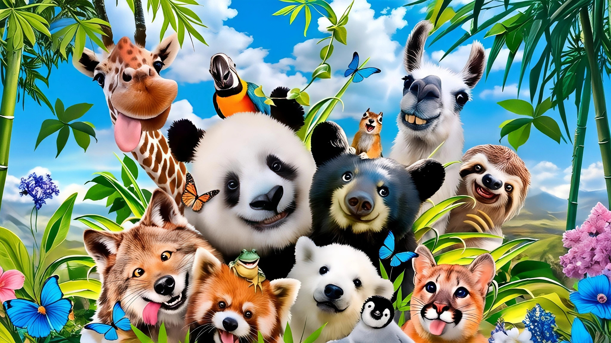
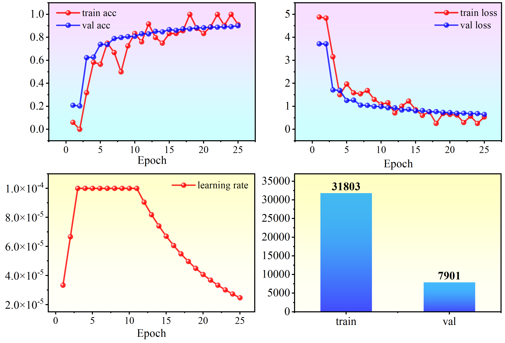
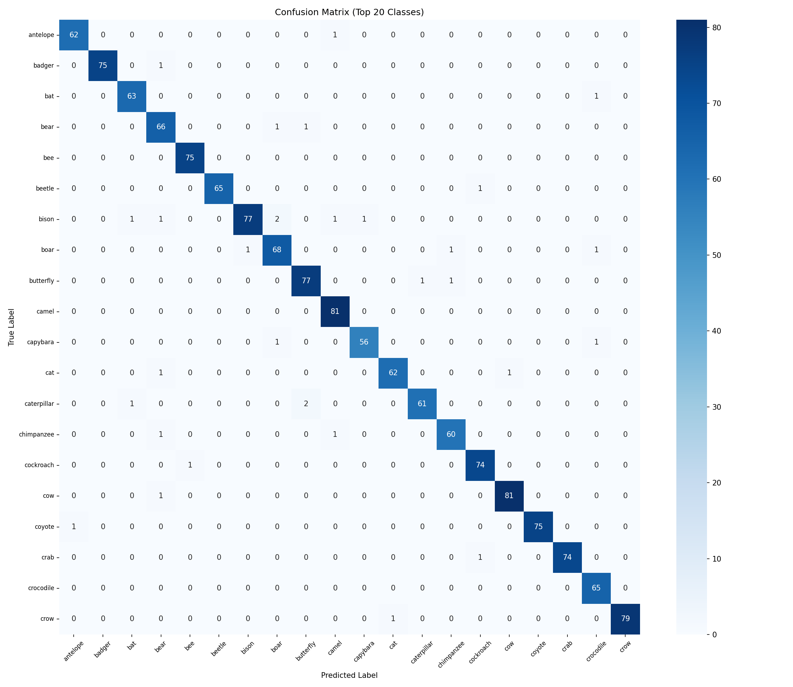
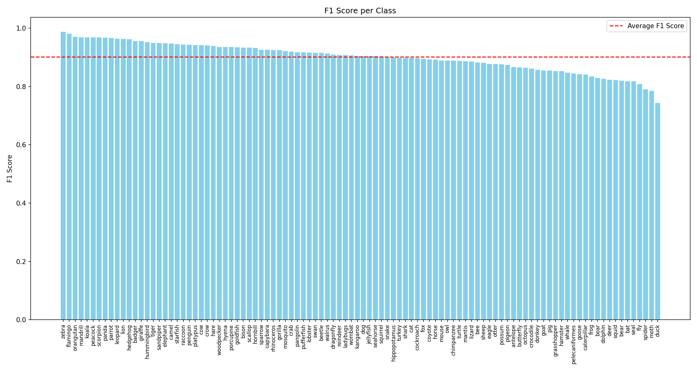

# **动物识别系统与动物认识游戏**



[](https://doi.org/10.57760/sciencedb.29221)[](https://pytorch.org/hub/nvidia_deeplearningexamples_efficientnet/)[](https://www.mit.edu/)

---

## 📋目录

- 🌟[项目介绍](#项目介绍)
- 📊[数据集说明](#数据集说明)
- 📁[文件夹结构](#文件夹结构)
- 🧠[模型架构实现](#模型架构实现)
- 🚀[快速开始](#快速开始)
- 📈[结果展示](#结果展示)

---

## 项目介绍

本项目是一个功能完整的动物识别系统，包含模型训练与交互应用两大部分。系统基于深度学习技术，能够对 100 种不同类别的动物进行准确识别，并通过精心设计的图形用户界面（GUI）提供友好的交互体验，同时包含一个动物认识的小游戏，以及动物图鉴功能。

该系统主要特点包括：

*   采用高效的 EfficientNetB6 模型作为基础架构，结合数据增强和正则化技术，实现高精度动物识别

*   提供三种核心功能：动物图片识别、动物认识小游戏和动物园图鉴

*   支持动物分类浏览（陆地、海洋、空中动物）

*   包含用户进度跟踪，记录解锁动物数量和游戏得分

*   采用现代化 UI 设计，具有动画效果和视觉反馈，提升用户体验


## 数据集说明

本项目使用的动物数据集包含 100 个不同类别的动物图片，因为使用网页图片提取下载，清洗由我一个人完全进行，数据集数据量较大，所以部分动物文件夹存在1%-1.5%的噪声图片，数据集组织结构如下：

*   总类别数：100 种动物

*   数据划分：采用 80% 作为训练集，20% 作为验证集

*   图片格式：支持常见图片格式（.jpg, .jpeg, .png 等）

在模型训练过程中，通过数据增强技术扩充了训练样本，包括旋转、平移、缩放、亮度调整等操作，以提高模型的泛化能力。

动物的类别信息请查看`class.txt`

数据集下载：[100种动物识别数据集](https://www.scidb.cn/detail?dataSetId=e2ebd46cb1304a82bab54a8873cb3004)

### 引用

==如果您使用了本项目的数据集，请使用如下方式进行引用：==

```
Haojing ZHOU. 100种动物识别数据集[DS/OL]. V1. Science Data Bank, 2025[2025-08-30]. https://cstr.cn/31253.11.sciencedb.29221. CSTR:31253.11.sciencedb.29221.
```

或

```tex
@misc{动物识别,
  author = {Haojing ZHOU},
  title  = {100种动物识别数据集},
  year   = {2025},
  doi    = {10.57760/sciencedb.29221},
  url    = {https://doi.org/10.57760/sciencedb.29221},
  note   = {CSTR: 31253.11.sciencedb.29221},
  publisher = {ScienceDB}
}
```

数据集类别和数量信息展示如下：


## 文件夹结构

```makefile
Animals_Recognition/
├── Animal/                         # 核心动物图片资源目录（按动物种类分类存储）
    ├── antelope/                   # 羚羊图片子目录
    └── ...                         # 其他动物子目录（共100种动物）
├── README-data.md                  # 数据相关说明文档
├── README.md
├── assets/                         # 静态资源目录
├── class.txt                       # 动物类别名称文件
├── data.ipynb
├── demo.mp4                        # 项目演示视频
├── demo.py                         # 主应用程序文件
├── log/
├── output/                         # 模型与输出结果目录
    ├── model/                      # 模型存储子目录
    └── pic/                        # 输出图片子目录
├── predict.py                      # 模型预测脚本
├── test/                           # 测试图片目录
├── train.py                        # 模型训练脚本
└── zoo_icons/                      # 动物园图鉴图标目录
```


## 模型架构实现

本项目的核心是基于 EfficientNetB6 的动物识别模型，其架构设计充分考虑了识别精度与计算效率的平衡，具体实现如下：

```python
base_model = EfficientNetB6(
    include_top=False,
    weights='imagenet',
    input_shape=(img_size[0], img_size[1], 3),
    pooling=None
)
```


### 迁移学习策略

采用部分冻结的迁移学习方法：

*   冻结底层 200 层：保留预训练模型学到的通用视觉特征

*   解冻上层网络：允许模型针对动物识别任务进行特异性调整

```python
base_model.trainable = True
for layer in base_model.layers[:200]:
    layer.trainable = False
```

### 自定义分类头

在基础模型之上添加了自定义分类层，具体结构如下：

1.  全局平均池化层：将特征图转换为固定长度的特征向量

```python
x = GlobalAveragePooling2D()(x)
```

2. 全连接层与正则化：

```python
x = Dense(1024, activation='relu', kernel_regularizer=l2(l2_reg))(x)
x = BatchNormalization()(x)
x = Dropout(dropout_rate)(x)
```

*   1024 维全连接层，使用 ReLU 激活函数和 L2 正则化

*   批归一化层：加速训练并提高稳定性

*   Dropout 层（30%）：防止过拟合

3. 第二个全连接层：

```python
x = Dense(512, activation='relu', kernel_regularizer=l2(l2_reg))(x)
x = BatchNormalization()(x)
x = Dropout(dropout_rate/2)(x)
```

*   512 维全连接层，同样使用 ReLU 激活和 L2 正则化

*   批归一化和较小比例（15%）的 Dropout

4. 输出层：

```python
x = Lambda(lambda t: tf.cast(t, tf.float32))(x)
predictions = Dense(num_classes, activation='softmax', dtype=tf.float32)(x)
```

*   100 维输出，对应 100 种动物

*   使用 softmax 激活函数生成类别概率分布

*   类型转换确保与混合精度训练兼容

### 训练策略与优化

1.  混合精度训练：

```python
tf.keras.mixed_precision.set_global_policy('mixed_float16')
```

加速训练过程并减少内存占用

2. 学习率调度：

```python
def accelerated_lr_schedule(epoch):
    warmup_epochs = 3
    decay_start = 10
    if epoch < warmup_epochs:
        return initial_lr * (epoch + 1) / warmup_epochs
    elif epoch < decay_start:
        return initial_lr
    else:
        return initial_lr * math.exp(0.1 * (decay_start - epoch))
```

*   预热阶段（3 个 epoch）：线性增加学习率

*   稳定阶段：保持初始学习率

*   衰减阶段：指数衰减以精细调整

3. 正则化技术：

*   L2 正则化（系数 1e-4）：减少权重过大

*   Dropout（30% 和 15%）：随机失活神经元

*   早停策略：监控验证损失，耐心值为 5

4. 优化器：

使用 Adam 优化器，初始学习率为 1e-4

```python
optimizer=Adam(learning_rate=initial_lr)
```

## 快速开始

### 环境要求

*   Python 3.7+


### 安装依赖

```bash
pip install -r requirements.txt
```

### 模型训练

1.  准备数据集，按照`Animal/[类别名称]/[图片文件]`的结构组织

2.  运行训练脚本：

```
python train.py
```

1.  训练完成后，模型将保存为`best_model.keras`

### 启动交互应用

1.  确保训练好的模型文件`best_model.keras`位于`./output/model/`目录

2.  准备类别名称文件`class.txt`，每行一个动物名称

3.  运行应用程序：

```
python demo.py
```

1.  应用启动后，可选择以下功能：

*   动物识别：上传图片进行动物识别
*   动物认识小游戏：通过图片选择正确动物名称
*   动物园图鉴：浏览已解锁的动物种类


## 结果展示

### 模型训练结果

训练过程中记录的关键指标包括：

1.  损失与准确率曲线：

*   训练损失与验证损失的变化趋势
*   训练准确率与验证准确率的提升过程



2. 混淆矩阵：

展示模型在验证集上的分类结果，对角线元素表示正确分类的样本数，非对角线元素表示分类错误的样本数。



3. 类别性能分析：

每个动物类别的精确率、召回率和 F1 分数，帮助识别模型表现较好和较差的类别。



模型在验证集抽取的样本预测展示如下所示：


### 应用界面展示

<video src="./demo.mp4"></video>
💡 GitHub可能无法正常显示缩略图，请查看demo.mp4